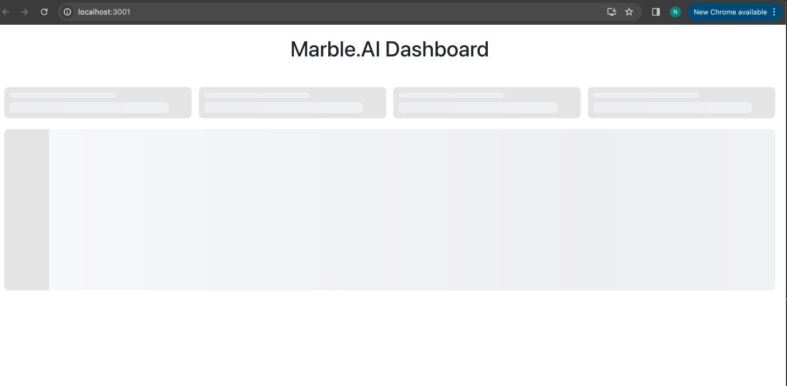
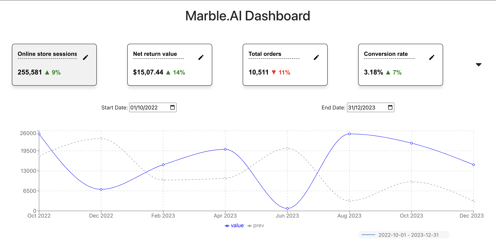
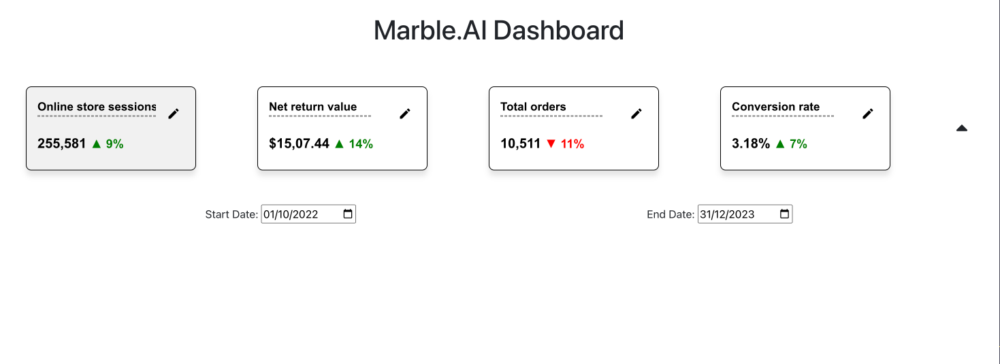

## Marble AI assignment

### I've not used Daisy UI or refine template, I've made custom web app using react-charts

### Steps to run

### Live Link : https://marble-ai-steel.vercel.app/


#### we need node and react version 18 to run this project
```bash
1. git clone https://github.com/nitishsaini706/MarbleAI
2. cd MarbleAi
3. npm install
4. npm start
```

### Features
1. Data Comparison: Compares current data with previous data using solid and dashed lines.
2. Interactive Elements: Offers Data comparison and on clicking tiles.


## Assumptions
1. I've used json data using states as no mock api was available on the web for financial data and that too with title and stats.

## Approach
1. I first created the Shimmer component.
2. Initially created component with static data for single line.
3. Added functionalities like modal to update data, static data.
4. Added prev value to show comparison.
5. Finally added date range for data comparison.


### Enhancements
1. If data/api would have been provided better chart comparison
2. If api would have been provided, many optimisations could have been done.


### ScreenShots





